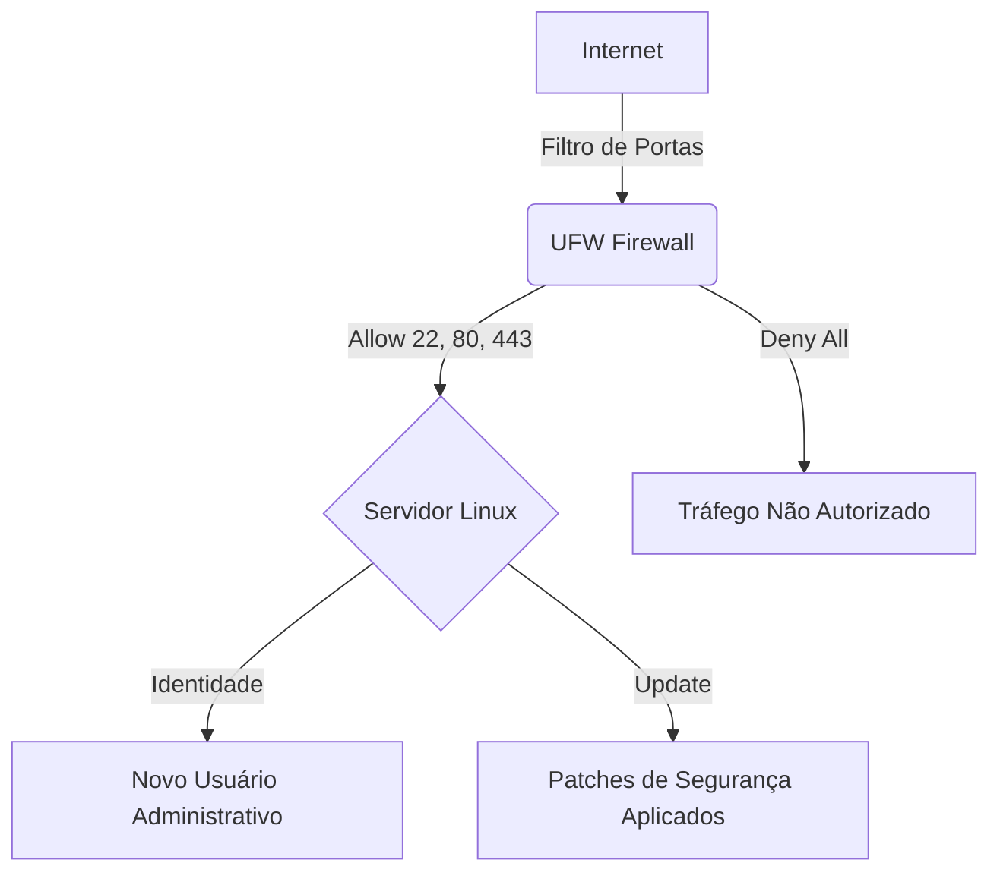

# 🛡️ ShieldLinux: Hardening Framework & Secure Deploy


Framework de automação para provisionamento seguro de instâncias Linux. Este projeto implementa as melhores práticas de segurança (CIS Benchmarks) para reduzir a superfície de ataque em servidores expostos à internet.

## 📊 Arquitetura de Segurança



## 📂 Estrutura do Projeto

```text
📂 shieldlinux-project
 ┣ 📂 scripts
 ┃ ┗ 📜 setup_hardening.sh   # Script principal de automação
 ┣ 📂 configs
 ┃ ┗ 📜 firewall.rules       # Definição das regras de rede
 ┗ 📜 README.md              # Documentação técnica
```

## 🚀 Guia de Instalação (Fast Track)

Para aplicar o hardening inicial, execute o comando abaixo dentro da sua instância:

```bash
# Clonar o repositório
git clone (https://github.com/igor-it-portfolio/shieldlinux-hardening.git)

# Entrar na pasta e dar permissão de execução
cd shieldlinux-hardening/scripts
chmod +x setup_hardening.sh

# Executar a blindagem
sudo ./setup_hardening.sh
```

## 🛠️ Operações e Monitoramento

Após a instalação, utilize estes comandos para validar a saúde do sistema:

* **Verificar Firewall:** `sudo ufw status verbose`
* **Auditar Acessos:** `tail -f /var/log/auth.log`
* **Status de Serviços:** `systemctl status ssh`

---
**Desenvolvido por [Igor Pantoja](https://www.linkedin.com/in/https://www.linkedin.com/in/igor-pantojacloud-system/)**
*"Segurança não é um produto, é um processo."*
